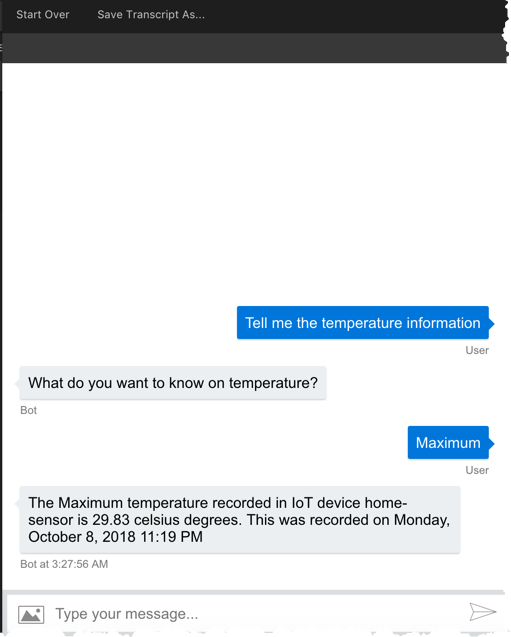

# Iot Sensor Chat Bot - Chat with your sensors

## Overview

In this reference app, we will

1. Connect a sensor Azure IoT MXChip starter kit to Azure IoT Hub
2. Send the sensor data to Azure Cosmos DB
3. Develop a chatbot/LUIS using Microsoft Bot Framework, that will allow us to ask the sensor information in human language. 

    >For e.g, what is average temperature? Tell me the minimum and maximum temperature?
4. Query CosmosDB to get the aggregated sensor value data.

## Architecture Diagram


## MxChip IoT Dev Kit

The development kit provides a smart hardware solution. It is compatible with abundant peripherals and sensors. **AZ3166** could be used for the development of IoT and smart hardware prototype,making it continent to verify the software and function of users.

With AZ3166, developers could cut down the period of research. AZ3166 has software and hardware and would be supported with developer community,including development kit and demo for quick connection to cloud service

For the first time user, follow the guidelines here to prepare you development environment. [https://microsoft.github.io/azure-iot-developer-kit/docs/get-started/](https://microsoft.github.io/azure-iot-developer-kit/docs/get-started/)

By following the above docs, you should be achieve the following items at this point.

1. Open the workspace in Visual Studio code.
2. Deploy Azure Service using `IoT Work bench Cloud`, that configures Iot Hub, Device connection string, Stream Analytics and Cosmos DB.
3. Configure IoT device with IoT hub device connection string (Device pairing) using `IoT Work bench Device - Config`
4. Deploy `Device` code into MXChip using `IoT Work bench Device - Upload`
5. Should be able to send Device to Cloud and Cloud to Device messaging. (Monitor `D2C and C2D messaging` from Visual studio code itself)

## Simulated Device

If you didn't have a device, nothing to worry. This repository includes SimulatedDevice which mimicks the real IoT device and send temperature/humidity information to IoTHub.

## Azure Stream Analytics

The below query will get the data from IoT Hub Event source and save in CosmosDB.

```
SELECT
    messageId,
    temperature,
    humidity,
    IotHub.ConnectionDeviceId
INTO
    "cosmosdb-xxxx"
FROM
    "iothub-yyyy"
```

## CosmosDB

Cosmos DB sample collection which is created using Azure stream analytics query.

```json
{
    "messageid": "876c443d-7686-4262-aec9-e9bfecd8e623",
    "temperature": 29.82508669421145,
    "humidity": 68.93062831638044,
    "connectiondeviceid": "home-sensor",
    "id": "15fdc6c6-3d75-2438-58da-392e40804e26",
    "_rid": "p5RwALIeY22qAAAAAAAAAA==",
    "_self": "dbs/p5RwAA==/colls/p5RwALIeY20=/docs/p5RwALIeY22qAAAAAAAAAA==/",
    "_etag": "\"01005fe1-0000-0000-0000-5bbc1e270000\"",
    "_attachments": "attachments/",
    "_ts": 1539055143
}
```

## LUIS - Create App, Intent, Entities

Let's create a LUIS app, Intent and entities required. If you are not familiar with LUIS,  you might want to follow this [tutorial](https://docs.microsoft.com/en-us/azure/cognitive-services/luis/what-is-luis).


### Entities

There are two types of entities we are looking for this project right now.

1. Aggregations (E.g latest, minimum, maximum, average, min, max, avg, right now, recent)
2. Sensor Type (E.g Temperature, temp, hot, weather, heat, warmth)

### Intents

The only one intent other than NONE intent we've used is `SensorInformation` intent.

E.g utterances.

* Can you give me sensor information?
* What is the temp right now?
* Temp please, is it hot?
* What is minimum and maximum temperature?
* Tell me the temperature info please

### Train and Publish

Train the model and publish it to the endpoint. Please note, if you want to add any training data, create issue with samples, I'll train the data.

## Bot Development
In this project, we are using NodeJS bot, that connects with LUIS to get the entities. As well as, it queries the cosmos db to get the temperature details.

## Demo / Transcripts





